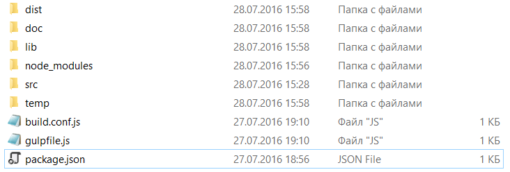

# Pip.WebUI Getting Started <br/> Step 1. Create application structure

### Setup development environment

If you don't have node.js installed on your computer, download and install it from [https://nodejs.org/en/download/](https://nodejs.org/en/download/).

Verify that you are running at least node v4.x.x and npm 3.x.x by running node -v and npm -v in a terminal/console window.

Install build tools:
```bash
npm install bower -g
npm install gulp-cli -g
```

### Create project folder structure

```
├── src
│    ├── index.html
│    ├── index.ts
│    ├── styles.less
├── package.json
├── gulpfile.js
├── build.conf.js
├── tsconfig.json
```

### Install dependencies

Create **package.json** file in the root folder, to define npm dependencies:

```javascript
{
  "name": "pip-webui-sample",
  "version": "1.0.0",
  "description": "Getting started sample for Pip.WebUI",
  "dependencies": {
  },
  "devDependencies": {
    "pip-webui-all": "git+https://github.com/pip-webui/pip-webui-all.git",
    "pip-webui-tasks": "git+https://github.com/pip-webui/pip-webui-tasks.git"
  }
}

```

Install npm dependencies by executing the command line:
```bash
npm install
```

Or create **bower.json** file in the root folder, to define bower dependencies:

```javascript
{
  "name": "pip-webui-sample",
  "version": "1.0.0",
  "description": "Getting started sample for Pip.WebUI",
  "dependencies": {
      "pip-webui": "^1.5.0"
  }
}

```

Install bower dependencies by executing the command line:
```bash
bower install
```

### Configure build tasks 

Create **gulpfile.js** file in the root folder, and define their build tasks using tasks provided **pip-webui-tasks** module:

```javascript
var gulp = require('gulp');
var runSequence = require('run-sequence');

// Add all standard tasks    
require('pip-webui-tasks').all(gulp);

// Define build tasks
gulp.task('build', function (callback) {
    runSequence('build-html-dev', ['build-bundle-dev', 'build-less-dev', 'build-lib', 'build-res'], 'build-dist', callback);
});

gulp.task('rebuild', function (callback) {
    runSequence('build-html-dev', ['build-bundle-dev', 'build-less-dev'], 'build-dist', callback);
});

gulp.task('clean', ['build-clean']);
gulp.task('watch', ['build-watch']);
gulp.task('lint', ['less-lint', 'js-lint']);
gulp.task('launch', ['app-launch']);

// Set default task
gulp.task('default', ['build']);
```

Create **build.conf.js** file in the root folder and define configuration for the build tasks:

```javascript
module.exports = {
    module: {
        name: 'app',
        styles: 'styles'
    },
    file: {
        lib: [
            'node_modules/pip-webui-all/dist/**/*'
        ]
    }
};
```

For more information on build tasks and configuration see [pip-webui-tasks module](https://github.com/pip-webui/pip-webui-tasks).

### Create stubs for application source files

In the **/src** folder create the following files:

##### index.js
```javascript
// Todo: add logic here
```

##### index.html
```html
<!DOCTYPE html>
<html lang="en">
<head>
    <meta charset="UTF-8">
    <title>Pip.WebUI Getting Started</title>
    <link rel="stylesheet" href="pip-webui-sample.css"/>
    <script src="pip-webui-sample.js"></script>
</head>
<body>
Nothing here yet!
</body>
</html>
```

##### styles.less
```
// Todo: add styles here
```

### Configure Typescript

Create **tsconfig.json** file in the root folder and define configuration for typescript build tasks:

```javascript
{
    "compilerOptions": {
		"declaration": true,
        "module": "commonjs",
        "target": "es5",
        "noImplicitAny": false,
        "outDir": "obj",
        "rootDir": ".",
        "sourceMap": true
    },
    "exclude": [
        "node_modules",
        "lib",
        "dist",
        "obj",
        "temp"
    ]
}
```

### Execute first build

In command line start the build process:
```bash
gulp build
```

If build is successful, in the root folder you can find two new folders **/lib** and **/dist**



Open your app by executing the command line:
```bash
gulp launch
```

You should see an empty web page.


### Continue

[Go to step 2](https://github.com/pip-webui/pip-webui-sample/blob/master/step2/) to create Angular boilerplate code in your application.
