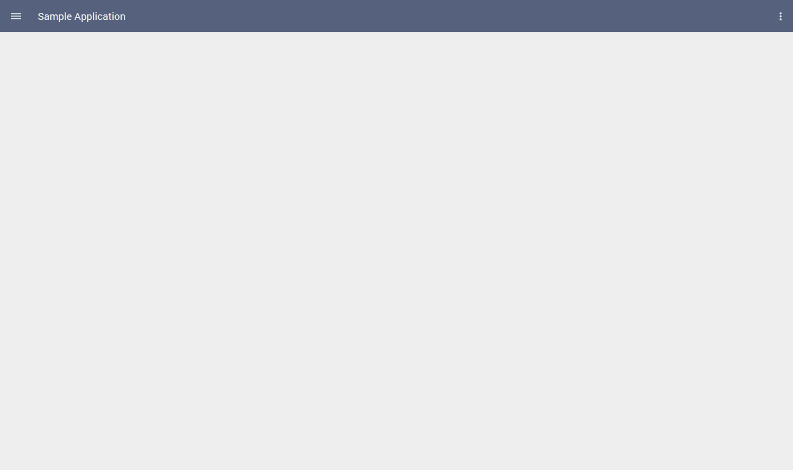

# Pip.WebUI Getting Started <br/> Step 3. Add global navigation

[Go to step 2](https://github.com/pip-webui/pip-webui-sample/blob/master/step2/Readme.md) to add **pip-webui** references.

### Include navigation components into the application

Add reference to **pipNav** in application module references:

```javascript
var app = angular.module('app', [
        // pipWebUI modules
        'pipRest', 'pipLayout', 'pipErrorHandling', 'pipWebuiTests', 'pipNav',

        // Application templates
        'app.Templates'
]);
```

### Add AppBar and SideNav into index.html

Place **pip-appbar** and **pip-sidenav** components under **pip-main** tag. Delete text **'Nothing here yet!'** from **pip-main-body** container:

```html
<body ng-app="app" ng-controller="appController">
    <pip-main>
        <pip-appbar></pip-appbar>
        <pip-sidenav></pip-sidenav>
        <pip-main-body ui-view></pip-main-body>
    </pip-main>
</body>
```

Rebuild the application. You shall see an empty application with a toolbar and sidenav.


### Configure AppBar

Load the default iconset, define global actions and default application title inside the application configuration section.

We will create a page for the global actions later. For now, you can see a routing error page if you try to trigger them.

```javascript
app.config(function (pipAuthStateProvider, $mdIconProvider, pipAppBarProvider) {
    // Load default iconset
    $mdIconProvider.iconSet('icons', 'images/icons.svg', 512);

    // Define global secondary actions (for actions popup menu) 
    pipAppBarProvider.globalSecondaryActions([
        {name: 'global.settings', title: 'Settings', state: 'settings'},
        {name: 'global.signout', title: 'Sign out', state: 'signout'}
    ]);

    // Configure states of application
    ....

    // Set default application title
    pipAppBarProvider.appTitleText('Sample Application');
});
```

Now configure what will be shown on the AppBar when the application loads.

```javascript
app.controller('appController', function($scope, pipAppBar, pipWebuiTest, pipTestDataService) {
        // Show application title
        pipAppBar.showAppTitleText('Sample Application'); 
        // Show icon to open sidenav
        pipAppBar.showMenuNavIcon();
        // Show button with tree dots for secondary actions
        pipAppBar.showLocalActions();
        // Create test data using pipWebUI services
        $scope.dataSet = pipTestDataService.createTestDataset();        
});
```

Such actions as signIn, signOut, signUp, users settings reading and editing, etc. are usually carried out with the application server.
We will not use a real server instead of the server (fake server) based on the mock-object.
You can read details about this [here](https://docs.angularjs.org/api/ngMockE2E/service/$httpBackend).

Also, we will run a fake server to test our requests locally `pipWebuiTest.runFakeServer('http://fakeserver.net');`. 

You can create fakeServer to any address, we chose **http://fakeserver.net**. 
Add the application server definition ** app.config **.

```javascript
app.config(function (pipAuthStateProvider, $mdIconProvider, pipAppBarProvider, pipRestProvider) {
    // Load default iconset
    $mdIconProvider.iconSet('icons', 'images/icons.svg', 512);

    // Define global secondary actions (for actions popup menu) 
    pipAppBarProvider.globalSecondaryActions([
        {name: 'global.settings', title: 'Settings', state: 'settings'},
        {name: 'global.signout', title: 'Sign out', state: 'signout'}
    ]);

    // Define application REST API server
    pipRestProvider.serverUrl('http://fakeserver.net');

    ...

});
```

Добавим запуск нашего fake server в **appController**.  

```javascript
app.controller('appController', function($scope, pipAppBar, pipWebuiTest, pipTestDataService) {
    // run fake server
    pipWebuiTest.runFakeServer('http://fakeserver.net');        

    ...

});
```

Теперь нам будет доступна функциональность, которая требует работы с сервером, 
например signIn и SignUp, которые мы добавим на следующем шаге.

When you rebuild the application, you will see the following:



When you click on tree dots on the right, a popup with secondary actions will open:


### Configure SideNav

Configure two links in SideNav inside the application configuration section:

```javascript
app.config(function (pipAuthStateProvider, $mdIconProvider, pipAppBarProvider, pipRestProvider, pipSideNavProvider) {
    ...
    
    pipSideNavProvider.sections([
        {
            links: [
                {title: 'Nodes', url: '/nodes'},
                {title: 'Events', url: '/events'}
            ]
        }
    ]);
});
```

Rebuild and open the application:


### Configure AppBar for custom pages

Add code to configure the AppBar inside page controllers:
```javascript
app.controller('nodesController', function($scope, pipAppBar) {
    // Show page title
    pipAppBar.showTitleText('Nodes');
    // Show menu icon to open sidenav
    pipAppBar.showMenuNavIcon();
    // Show local actions in secondary actions popup
    pipAppBar.showLocalActions();
});

app.controller('eventsController', function($scope, pipAppBar) {
    // Show page title
    pipAppBar.showTitleText('Events');
    // Show menu icon to open sidenav
    pipAppBar.showMenuNavIcon();
    // Show local actions in secondary actions popup
    pipAppBar.showLocalActions();
});
```

### Continue

For more information on Appbar and SideNav, please, visit [pip-webui-nav module](https://github.com/pip-webui/pip-webui-nav)

[Go to step 4](https://github.com/pip-webui/pip-webui-sample/blob/master/step4/) to add sign in and sign up pages.
