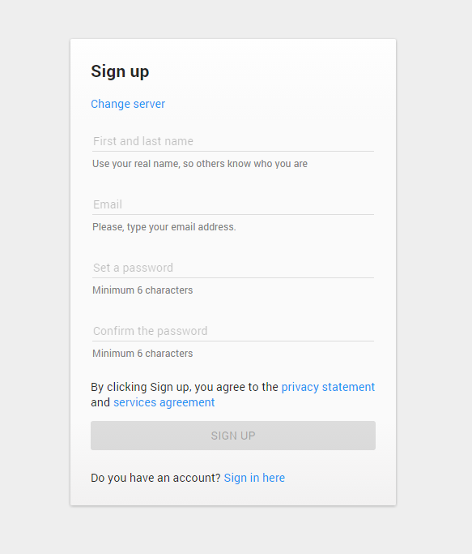

# Pip.WebUI Getting Started <br/> Step 4. Add sign in and sign up

[Go to step 3](https://github.com/pip-webui/pip-webui-sample/blob/master/step3/) to configure navigation in your application using pip.WebUI components

To initialize **signin** and **signup** states was connected **pipEntry** in [step 2](https://github.com/pip-webui/pip-webui-sample/blob/master/step2/)

### Add link to go to **signin** page

To go to **signin** page add **Sign Out** link with such url:**/signout** to sidenav sections
It will look like this:

```javascript
pipSideNavProvider.sections([
    {
        links: [
            {title: 'Module 1', url: '/module_1'},
            {title: 'Module 2', url: '/module_2'}
        ]
    },
    {
        links: [
            {title: 'Sign Out', url: '/signout'}
        ]
    }
]);
```

### Add **pip-main-body** tag

After add **pip-main-body** tag with ui-view attribute inside **pip-main** tag in your **index.html**

```html
<pip-main>
        ...

        <pip-main-body ui-view></pip-main-body>
        
        ...
</pip-main>
```

### Configure states and add controllers

Also you need to configure states to go to your application pages after authorization

```javascript
thisModule.config(function (pipSideNavProvider, $mdIconProvider, pipAppBarProvider) {
    ...

     // Configure states of application
     pipAuthStateProvider
        .state('module_1', {
            url: '/module_1',
            controller: 'module1Controller',
            auth: true
        })
        .state('module_2', {
            url: '/module_2',
            controller: 'module2Controller',
            auth: true
        });
     
     // Configure default states
     pipAuthStateProvider.unauthorizedState('signin');
     pipAuthStateProvider.authorizedState('module_1');
    
    $urlRouterProvider.otherwise(function ($injector, $location) {
        return $location.$$path === '' ? '/signin' : '/tiles_view';
    });
    ... 
});
```

After add controllers for your states like this:

```javascript
thisModule.controller('module1Controller', function($scope, pipAppBar) {
    pipAppBar.showTitleText('Sample 1'); // Show title of application or specific page
    pipAppBar.showMenuNavIcon(); // Show button in appbar, which open sidenav
    pipAppBar.showLocalActions(); // Show actions of your application
});

thisModule.controller('module2Controller', function($scope, pipAppBar) {
    pipAppBar.showTitleText('Sample 2'); // Show title of application or specific page
    pipAppBar.showMenuNavIcon(); // Show button in appbar, which open sidenav
    pipAppBar.showLocalActions(); // Show actions of your application
});
```

Update page in browser and you shall see **Sing in** page


Click **Sign up here** link and you will see **Sign up** form



After **sign up** you will see **post sign up** form. Fill form fields (if you want), click **continue** button and you will see pages of your application

### Continue

[Go to step 5](https://github.com/pip-webui/pip-webui-sample/blob/master/step5/) to add settings and help to your application.