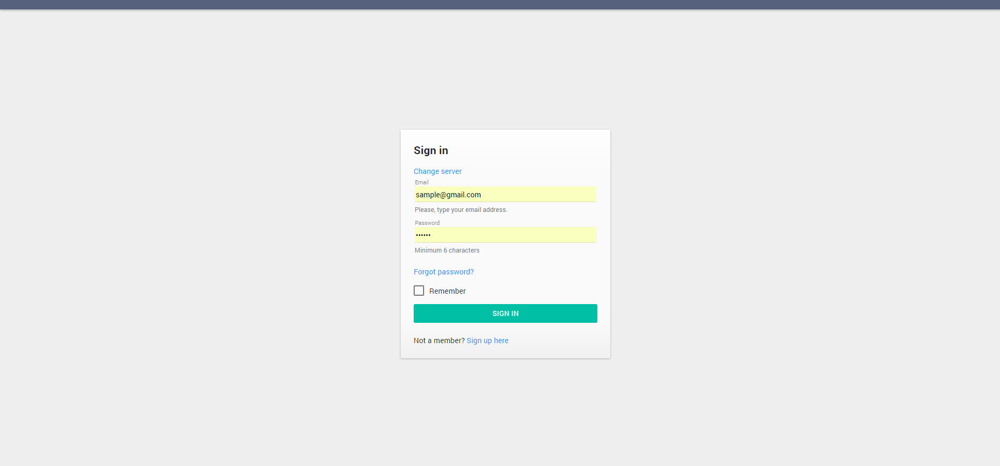

# Pip.WebUI Getting Started <br/> Step 4. Add sign-in and sign-up pages

[Go to step 3](https://github.com/pip-webui/pip-webui-sample/blob/master/step3/) to add global application configuration.

### Include entry pages into the application

Add **pipEntry** into the application module references:

```javascript
var app = angular.module('app', [
        // pipWebUI modules
        'pipRest', 'pipLayout', 'pipErrorHandling', 'pipWebuiTests', 'pipNav', 'pipEntry',

        // Application templates
        'app.Templates'
]);
```

### Configure routing to sign-in page

Now add default routing states into the configuration section. 
Unauthorized users will see **signin** page when they open the application.
After a successful signin, they the user will see the **nodes** page.

In this example, we will use a test user for the sign-in **(email: test@sample.net, password: any password)**.

```javascript
app.config(function (pipAuthStateProvider, $mdIconProvider, pipAppBarProvider, pipSideNavProvider, 
    pipRestProvider, $urlRouterProvider) {
    ...
     // Configure default states
     pipAuthStateProvider.unauthorizedState('signin');
     pipAuthStateProvider.authorizedState('nodes');
    
    $urlRouterProvider.otherwise(function ($injector, $location) {
        return $location.$$path === '' ? '/signin' : '/nodes';
    });
});
```


### Add a link to sign-out

To support signout, add a link to **/signout** route into the Sidenav config inside the application configuration section.
To go to the **signin** page, add **Sign Out** link with such url:**/signout** to SideNav sections.
It should look like this:

```javascript
app.config(function (pipAuthStateProvider, $mdIconProvider, pipAppBarProvider, pipSideNavProvider, 
    pipRestProvider, $urlRouterProvider) {
    ...
    pipSideNavProvider.sections([
        {
            links: [
                {title: 'nodes', url: '/nodes'},
                {title: 'events', url: '/events'}
            ]
        },
        {
            links: [
                {title: 'Sign Out', url: '/signout'}
            ]
        }
    ]);
    ...
});
```

Rebuild the application. Now you shall see **sing in** when you open the application in the browser:



When you click **Sign up here** the **sign up** form will open up:


After a successful **sign up**, the user will be taken to the **post sign up** form where they can enter additional details about themselves.
On **Continue** the application will open the default **nodes** page:


### Continue

[Go to step 5](https://github.com/pip-webui/pip-webui-sample/blob/master/step5/) to add settings and help pages.
