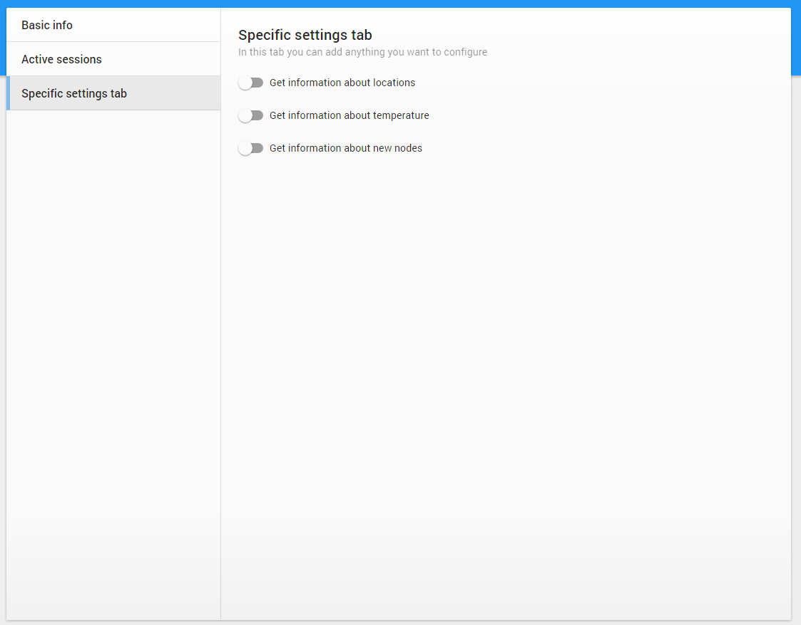

# Pip.WebUI Getting Started <br/> Step 5. Add settings and help

[Go to step 4](https://github.com/pip-webui/pip-webui-sample/blob/master/step4/) to add sign in and sign up pages to your application

To initialize **settings** states was connected **pipSettings** in [step 2](https://github.com/pip-webui/pip-webui-sample/blob/master/step2/)

To initialize **help** states was connected **pipHelp** in [step 2](https://github.com/pip-webui/pip-webui-sample/blob/master/step2/)

### Add link to go to Settings

To go to settings page add **Settings** link with such url:**/settings** to sidenav sections
It will look like this:

```javascript
pipSideNavProvider.sections([
    {
        links: [
            {title: 'Module 1', url: '/module_1'},
            {title: 'Module 2', url: '/module_2'}
        ]
    },
    {
        links: [
            {title: 'Settings', url: '/settings'},
            {title: 'Sign Out', url: '/signout'}
        ]
    }
]);
```

### Configure pip.WebUI components for determining the geolocation

For determining the geolocation by pip.WebUI components add such link to head tag of your **index.html**

```html
<head lang="en">
    ...
    
    <script src="http://maps.googleapis.com/maps/api/js?sensor=false"></script>
    
    ...
</head>
```

Todo: describe how to get Google Map Key

### Standard settings tabs and how to add specific tab

If you click **Settings** link in sidenav you will see page with list of default settings tabs:

* Basic info
* Active sessions


Using **pipSettings** services you can add specific tab

```javascript
thisModule.config(
        function (pipSideNavProvider, $mdIconProvider, pipAppBarProvider, pipAuthStateProvider, pipSettingsProvider) {
        ...
        
        pipSettingsProvider.addTab({
            state: 'specific_settings_tab',
            title: 'Specific settings tab',
            auth: true,
            stateConfig: {
                url: '/specific_settings_tab',
                templateUrl: 'settings_tab.html'
            }
        });
        
        ...
        }
);

```

Tab template **settings_tab.html**

```html
<div class="pip-details-title">
    <p class="pip-title">
        Specific settings tab
    </p>

    <p class="pip-subtitle ">
        In this tab you can add anything you want to configure
    </p>
    
    <md-switch>
            Get information about locations
    </md-switch>
    
    <md-switch>
        Get information about temperature
    </md-switch>
    
    <md-switch>
        Get information about new nodes
    </md-switch>
</div>
```

Add such template to your **/src** folder and you shall see:



### Add link to go to Help and configure help tabs

To go to help pages add **Help** link with such url:**/help** to sidenav sections
It will look like this:

```javascript
pipSideNavProvider.sections([
    {
        links: [
            {title: 'Module 1', url: '/module_1'},
            {title: 'Module 2', url: '/module_2'}
        ]
    },
    {
        links: [
            {title: 'Help', url: '/help'},
            {title: 'Settings', url: '/settings'},
            {title: 'Sign Out', url: '/signout'}
        ]
    }
]);
```

After you need to add specific **help** tab

```javascript
thisModule.config(
        function (pipSideNavProvider, $mdIconProvider, pipAppBarProvider, pipAuthStateProvider, pipSettingsProvider, pipHelpProvider) {
        ...
        
        pipHelpProvider.addTab({
            state: 'specific_help_tab',
            title: 'Specific help tab',
            auth: true,
            stateConfig: {
                url: '/specific_help_tab',
                templateUrl: 'help_tab.html'
            }
        });
        
        ...
        }
);
```

Add template **help_tab.html** to your **/src** folder and you shall see:

```html
<div class="pip-details-title">
    <p class="pip-title">
        Specific help tab
    </p>

    <p class="pip-subtitle ">
        Here you can describe current help tab
    </p>

    <p>Here put information which can help users.</p>
</div>
```

And you shall see such page after click **help** link in sidenav:


### Continue

[Go to step 6](https://github.com/pip-webui/pip-webui-sample/blob/master/step6/) to add IoT Nodes page with tiles view to your application