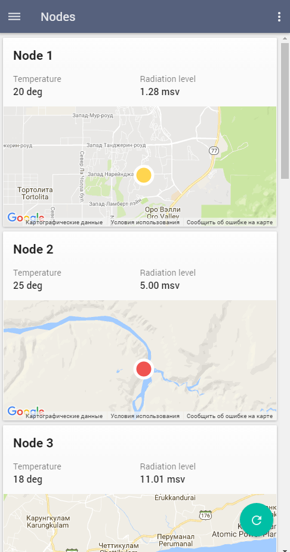

# Pip.WebUI Getting Started <br/> Step 6. Add Nodes page with tiles view

[Go to step 5](https://github.com/pip-webui/pip-webui-sample/blob/master/step5/) to add settings, feedback and help pages.

### Create nodes tiles view

Create **/nodes** folder under **/src** and place there **nodes.html** file with the following content.
It will display a tile view with IoT nodes showing their name, measurements and current location:

```html
<pip-tiles class="layout-fill pip-no-tabs" column-width="440">
    <div class="masonry-brick pip-tile w440-flex " ng-repeat="node in nodes">
        <div class="p16">
            <h2 class="pip-title tm0">{{ node.name }}</h2>
            <div class="layout-row">
                <div class="layout-column flex">
                    <div class="flex color-secondary-text">Temperature</div>
                    <div class="flex text-subhead2">{{ node.temperature }}</div>
                </div>
                <div class="layout-column flex">
                    <div class="flex color-secondary-text">Radiation level</div>
                    <div class="flex text-subhead2">{{ node.radiation_level }}</div>
                </div>
            </div>
        </div>
        <div class="pip-tile-location-container">
            <pip-location-map pip-location-pos="location_points[$index]" pip-icon-path="iconPath"
                              pip-stretch="true" class="h-stretch">
            </pip-location-map>
        </div>
    </div>
</pip-tiles>
<md-button class="md-fab md-accent md-fab-bottom-right" aria-label="refresh">
    <md-tooltip md-direction="left">Refresh</md-tooltip>
    <md-icon md-svg-icon="icons:reload"></md-icon>
</md-button>
```

### Create nodes controller

Todo: Each node shall have its own location!
Todo: Can we add the hook to resize tiles into the framework?

Create **nodes.js** file under **/src/nodes** folder and copy the following code there:

We will receive data our test dataset. Use `$scope.dataSet.get('NodesTestCollection').getAll()` to read data from a set of 'NodesTestCollection'.

```javascript
(function (angular) {

    var thisModule = angular.module('nodesModule', []);

    thisModule.controller('nodesController', function($scope, pipAppBar) {
        // Show page title
        pipAppBar.showTitleText('Nodes');
        // Show menu icon to open sidenav
        pipAppBar.showMenuNavIcon();
        // Show local page actions
        pipAppBar.showLocalActions();
        // Add shadow under the appbar
        pipAppBar.showShadow();
        // Get test data
        $scope.nodes = $scope.dataSet.get('NodesTestCollection').getAll();
        
        $scope.iconPath = 'M0,15a15,15 0 1,0 30,0a15,15 0 1,0 -30,0';
        
        $scope.location_points = getLocations();
        
        function getLocations() {
            var points = [];
        
            $scope.nodes.forEach(function (node) {
                points.push(node.location_points);
            });
        
            return points;
        }
    });

})(window.angular);
```

### Add page into the application

Add **nodesModule** into the application module references in **index.js**:

```javascript
var app = angular.module('app', [
    ...
    
    // Sample application modules
    'nodesModule'
]);
```

Make changes to the routing states in the configuration section:

```javascript
app.config(
    function (pipSideNavProvider, $mdIconProvider, pipAppBarProvider, pipAuthStateProvider, 
                  pipSettingsProvider, pipHelpProvider, $urlRouterProvider, pipRestProvider) {
        ...
        // Configure routing states
        pipAuthStateProvider
            .state('nodes', { 
                url: '/nodes', 
                controller: 'nodesController', 
                templateUrl: 'nodes/nodes.html', // <---- Pay attention!
                auth: true
            })
            .state('events', {
                url: '/events',
                controller: 'eventsController',
                template: '<h1>Events Page</h1>',
                auth: true
            });
        ...
    }
);
```

Remove old **nodesController** from **index.js**:

```javascript
// Remove
//app.controller('nodesController', function($scope, pipAppBar) {
//   ....
//});
```

Rebuild and reopen the application. You will see now:

Todo: Update the picture to remove that "special tile":


Resize the window and see those the page responses to fit a smaller screen:



### Continue

[Go to step 7](https://github.com/pip-webui/pip-webui-sample/blob/master/step7/) to add Events page with table view
