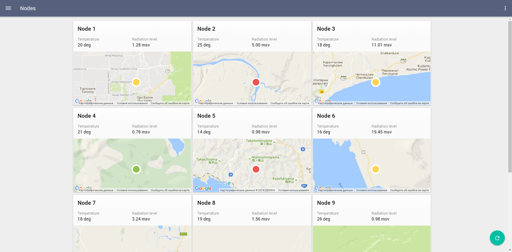

# Pip.WebUI Getting Started <br/> Step 6. Add IoT Nodes page with tiles view

[Go to step 5](https://github.com/pip-webui/pip-webui-sample/blob/master/step5/) to add settings and help to your application.

### Add special template and controller to display tiles in module of your application

In the **/src** create **tile_view** folder and create the following tree file inside.

##### tile_view.html

```html
<pip-tiles class="layout-fill" column-width="440">
    <div class="masonry-brick pip-tile w440-flex">
        <div class="p24-flex">
            <div class="pip-details-title">
                <p class="pip-title">This is a special node</p>
                <p class="pip-subtitle">Near</p>
            </div>
        </div>
    </div>

    <div class="masonry-brick pip-tile w440-flex " ng-repeat="node in nodes">
        <div class="p24-flex">
            <div class="pip-details-title">
                <p class="pip-title">{{ node.name }}</p>
                <p class="pip-subtitle">Temperature: {{ node.temperature }}</p>
            </div>
        </div>
    </div>
</pip-tiles>
```

##### tile_view.js

```javascript
(function (angular) {

    var thisModule = angular.module('tilesViewModule', []);

    thisModule.controller('tilesViewController', function($scope, pipAppBar) {

        $scope.nodes = [
            {name: 'Node 1', temperature: '20 deg'},
            {name: 'Node 2', temperature: '25 deg'},
            {name: 'Node 3', temperature: '18 deg'},
            {name: 'Node 4', temperature: '21 deg'},
            {name: 'Node 5', temperature: '14 deg'},
            {name: 'Node 6', temperature: '16 deg'},
            {name: 'Node 7', temperature: '18 deg'},
            {name: 'Node 8', temperature: '19 deg'},
            {name: 'Node 9', temperature: '26 deg'},
            {name: 'Node 10', temperature: '23 deg'}
        ];

        pipAppBar.showTitleText('Tiles View'); // Show title of application or specific page
        pipAppBar.showMenuNavIcon(); // Show button in appbar, which open sidenav
        pipAppBar.showLocalActions(); // Show actions of your application
        pipAppBar.showShadow(); // Show shadow of appbar
    });

})(window.angular);
```

### Update your index.js

Connect **tiles** module to main module of application

```javascript
var thisModule = angular.module('pipWebUISampleModule', [
    ...
    
    // Sample application modules
    'tilesViewModule'
    
    ...
]);
```

Update **config**

```javascript
thisModule.config(
    function (pipSideNavProvider, $mdIconProvider, pipAppBarProvider, pipAuthStateProvider, 
              pipSettingsProvider, pipHelpProvider, $urlRouterProvider) {
        ...

        // Configure states of application
        pipAuthStateProvider
            .state('tiles_view', { // <---- Pay attention!
                url: '/tiles_view', // <---- Pay attention!
                controller: 'tilesViewController', // <---- Pay attention!
                templateUrl: 'tiles_view/tiles_view.html', // <---- Pay attention!
                auth: true
            })
            .state('module_2', {
                url: '/module_2',
                controller: 'module2Controller',
                auth: true
            });

        // Configure default states
        pipAuthStateProvider.unauthorizedState('signin');
        pipAuthStateProvider.authorizedState('tiles_view'); // <---- Pay attention!
        
        $urlRouterProvider.otherwise(function ($injector, $location) {
            return $location.$$path === '' ? '/signin' : '/tiles_view'; // <---- Pay attention!
        });

        // Configure sidenav sections
        pipSideNavProvider.sections([
            {
                links: [
                    {title: 'Tiles View', url: '/tiles_view'}, // <---- Pay attention!
                    {title: 'Module 2', url: '/module_2'}
                ]
            },
            {
                links: [
                    {title: 'Help', url: '/help'},
                    {title: 'Settings', url: '/settings'},
                    {title: 'Sign Out', url: '/signout'}
                ]
            }
        ]);
        
        ...
    }
);
```

After all changes instead of module_1 state you should get **tiles view**:



### Continue

[Go to step 7](https://github.com/pip-webui/pip-webui-sample/blob/master/step7/) to add Maintenance Events page with table view