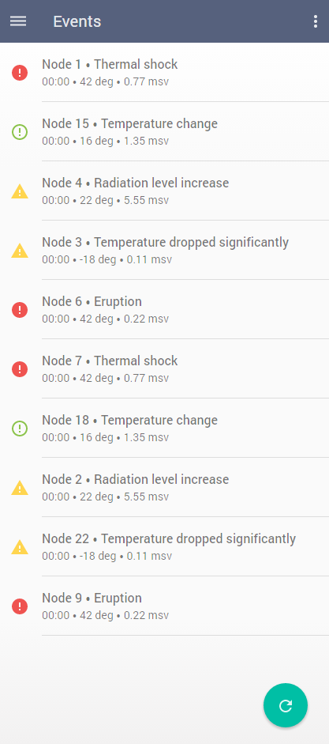

# Pip.WebUI Getting Started <br/> Step 7. Add Events page with table view

[Go to step 6](https://github.com/pip-webui/pip-webui-tutorial/blob/master/step6/) to add Nodes page with tiles view.

### Create events table view

Replace content of **events.html** page with the content below. The page will show events from IoT nodes as a table on the Desktop and Table and as a list on Phones.

```html
<md-toolbar class="pip-appbar-ext">
</md-toolbar>

<pip-document class="app-events">
    <div ng-show="vm.pipMedia('gt-sm')" class="scrolled-container">
        <table class="w-stretch">
            <thead class="color-secondary-text">
                <tr class="h48 text-left">
                    <th class="divider-bottom"><!--For icons--></th>
                    <th class="divider-bottom">Time</th>
                    <th class="divider-bottom">Node ID</th>
                    <th class="divider-bottom">Node Name</th>
                    <th class="divider-bottom">Description</th>
                    <th class="text-right divider-bottom">Temperature</th>
                    <th class="text-right rp16 divider-bottom">Radiation level</th>
                </tr>
            </thead>
            <tbody>
                <tr class="h48 text-subhead2 divider-bottom" ng-repeat="event in vm.events">
                    <td class="lp16 divider-bottom">
                        <md-icon ng-style="{color: iconColors[event.icon]}"
                                 md-svg-icon="icons:{{ event.icon }}">
                        </md-icon>
                    </td>
                    <td class="divider-bottom">00:00</td>
                    <td class="divider-bottom">{{ event.node_id }}</td>
                    <td class="divider-bottom">{{ event.node_name }}</td>
                    <td class="divider-bottom">{{ event.description }}</td>
                    <td class="text-right divider-bottom">{{ event.temperature }}</td>
                    <td class="text-right rp16 divider-bottom">{{ event.rad_level }}</td>
                </tr>
            </tbody>
        </table>
    </div>
    <div ng-show="!vm.pipMedia('gt-sm')" class="scrolled-container">
        <div ng-repeat="event in vm.events" class="layout-row layout-align-start-center">
            <div class="flex-fixed lp16 rp16">
                <md-icon ng-style="{color: iconColors[event.icon]}"
                         md-svg-icon="icons:{{ event.icon }}">
                </md-icon>
            </div>
            <div class="flex layout-column layout-align-start-start divider-bottom color-secondary-text tp16 bp16">
                <div class="flex text-subhead2 w-stretch">
                    <span >Node {{ event.node_name }}</span> ⦁
                    <span >{{ event.description }}</span>
                </div>
                <div class="flex w-stretch">
                    <span >00:00</span> ⦁
                    <span >{{ event.temperature }}</span> ⦁
                    <span >{{ event.rad_level }}</span>
                </div>
            </div>
        </div>
    </div>
    <md-button class="md-fab md-accent md-fab-bottom-right" aria-label="refresh">
        <md-tooltip md-direction="left">Refresh</md-tooltip>
        <md-icon md-svg-icon="icons:reload"></md-icon>
    </md-button>
</pip-document>
```

### Update events controller

Update **events.ts** file with the following code:

```javascript
'use strict';

function configureEventRoutes(
    $stateProvider: ng.ui.IStateProvider
) {
    "ngInject";

    // Configure module routes
    $stateProvider.state('events', {
        url: '/events',
        controller: EventsController,
        controllerAs: 'vm',
        templateUrl: 'events/events.html'
    });
}

export class IoTEvent {
    public icon: string;
    public node_id: string;
    public node_name: string;
    public description: string;
    public temperature: number;
    public rad_level: number;
}

export class EventsController {
    private _descriptions: string[] = ['Raised temperature', 'Lowered temperature', 'Change location'];
    private _icons: string[] = ['tr-errors', 'info-circle', 'location']

    public constructor(
        pipNavService: pip.nav.INavService,
        pipMedia: pip.layouts.IMediaService
    ) {
        pipNavService.appbar.show();
        pipNavService.sidenav.show();
        pipNavService.breadcrumb.text = "Events";
        this.pipMedia = pipMedia;

        this.events = this.generateEvents();
    }

    public pipMedia: pip.layouts.IMediaService;
    public events: IoTEvent[] = [];

    private random(min: number, max: number): number {
        return (Math.random() * (max - min) + min);
    }

    private generateEvents(): IoTEvent[] {
        let events: IoTEvent[] = [],
            eventsCount = 30,
            maxTemp = 50,
            minTemp = -50,
            maxRadLev = 150,
            minRadLevel = 80,
            maxNodeNum = 15;

        for (let i = 0; i < eventsCount; i++) {
            let randType = this.random(0, this._descriptions.length - 1).toFixed(0);

            events.push({
                icon: this._icons[randType],
                node_id: this.random(0, maxNodeNum).toFixed(0),
                node_name: 'Node ' + this.random(0, maxNodeNum).toFixed(0),
                description: this._descriptions[randType],
                temperature: this.random(minTemp, maxTemp),
                rad_level: this.random(minRadLevel, maxRadLev)
            });
        }

        return events;
    }

}

angular
    .module('app.Events', [ ])
    .config(configureEventRoutes);
```

Add styles to **events.less** in **/src/events** folder
```css
.app-events {
    table {
      border-collapse: collapse
    }
}
.app_events.pip-document {
  .scrolled-container {
    overflow: auto;
  }
}
```

Add link to **styles.less** file
```css
@import "events/events.less";
```

Rebuild and reopen the application. You shall see now:


Resize browser windows to the size of a phone:



### Continue

[Go to step 8](https://github.com/pip-webui/pip-webui-tutorial/blob/master/step8/) to show notifications.
