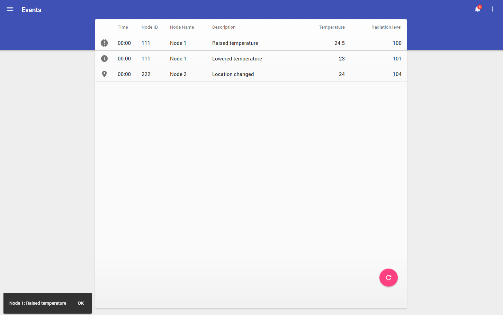

# Getting Started With Pip.WebUI <br/> Step 8. Show notifications

[Go to step 7](https://github.com/pip-webui/pip-webui-tutorial/blob/master/step7/) if you haven't already, to add the table view to the Events page.

### Show notifications as toast messages

In order to add notification service to the application, create a **notifications.ts** file in **/src/notifications** and place the code below:

```javascript
export interface INotificationService {
    start(): void;
    stop(): void;
    data(data: string[]): void;
}

export class NotificationAction {
    static Ok: string = "OK";
}

export class NotificationService implements INotificationService {
    private _$interval: angular.IIntervalService;
    private _stopTime: any;
    private _showCount: number = 0;
    private _interval: number = 20000;
    private _pipNavService: pip.nav.INavService;
    private _pipToasts: any;
    private _data: string[] = [
        'Node 1: Raised temperature',
        'Node 1: Lowered temperature',
        'Node 2: Location changed'
    ];

    constructor(
        $interval: angular.IIntervalService,
        pipNavService: pip.nav.INavService,
        pipToasts: any
    ) {
        "ngInject";

        this._$interval = $interval;
        this._pipNavService = pipNavService;
        this._pipToasts = pipToasts;
    }

    private show() {
        let index;

        this._showCount++;
        index = this._data.length > this._showCount ? this._showCount: this._showCount % this._data.length;

        this.updateCounts();
        // Show a toast message
        this._pipToasts.showNotification(this._data[index], [NotificationAction.Ok], () => {});
    }

    private updateCounts() {
        // Show badge with number of notifications in application bar actions
        this._pipNavService.actions.updateCount('global.notifications', this._showCount);
        // Show badge with number of notifications in side navigation menu link
        this._pipNavService.menu.updateCount('events', this._showCount);
    }

    public start() {
        if (this._data.length === 0) return;

        this._stopTime = this._$interval(() => { this.show(); }, this._interval);
    }

    public stop() {
        this._$interval.cancel(this._stopTime);
        this._showCount = 0;
        this.updateCounts();
    }

    public data(data: string[]) {
        this._data = data;
    }

}

angular.module('app.Notifications', [])
    .service('notificationService', NotificationService);
```

Import **notifications.ts** and the **notification service interface**, then update the **app controller** and add the notifications module in **index.ts**:

```javascript
 'use strict';

...
// >>>> Changes start here >>>>
import './notifications/notifications';
import { INotificationService } from './notifications/notifications';
// >>>> Changes end here >>>>
...

// >>>> Changes start here >>>>
class AppController {
    public constructor(
        notificationService: INotificationService
    ) {
        "ngInject";

        notificationService.start();
    }
};
// >>>> Changes end here >>>>

angular
    .module('app', [
        'ngMaterial',
        'pipLayout', 
        'pipNav', 
        'pipControls',
        'pipBehaviors',
        'pipServices', 
        'pipTheme',
        'pipSettings',
        'pipButtons',
        'pipLocations',

        'app.Templates',
        'app.Events',
        'app.Nodes',
        'app.Settings.Sample',
// >>>> Changes start here >>>>
        'app.Notifications'
// Changes end gere
    ])
    .config(configureApp)
    .controller('appController', AppController);
```

After that, rebuild the app and you shall see the page below:

 

Then find the badge with the current notification count in the application bar:


And, find the notifications badge in side navigation menu:
 

### Continue to step 9

[Go to step 9](https://github.com/pip-webui/pip-webui-tutorial/blob/master/step9/) to add a map view to Nodes page.
